<h3>IMetier<3>
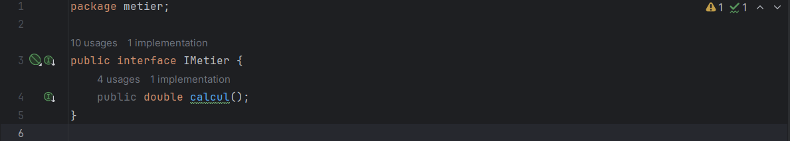

<h4>MetierImpl</h4>
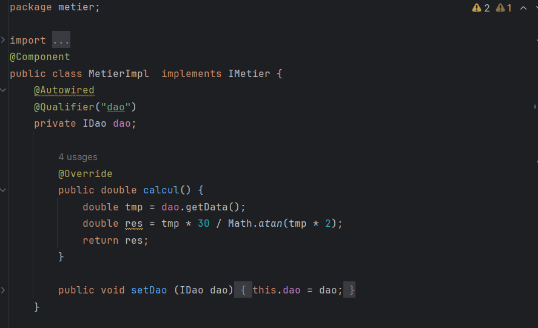

<h3>IDao<h3>
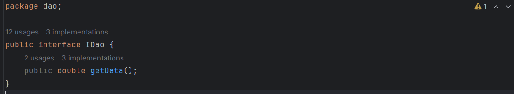

<h3>DaoImpl<h3>
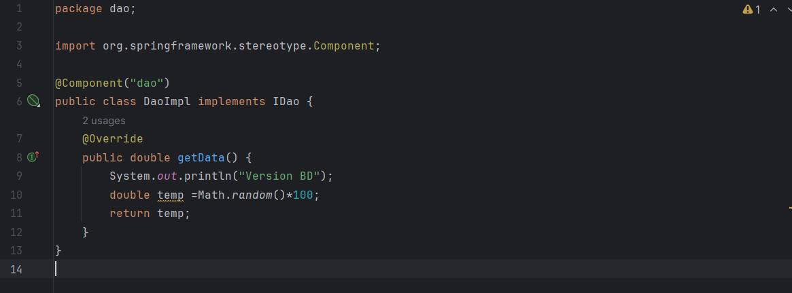

<h4>DaoImpl2</h4>
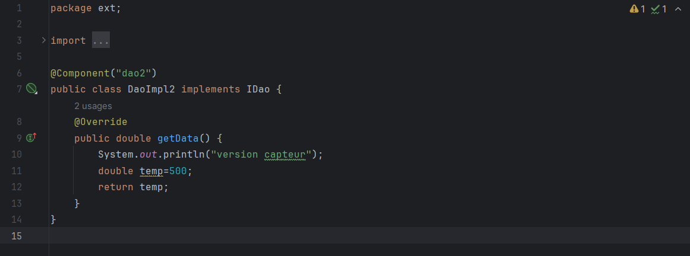

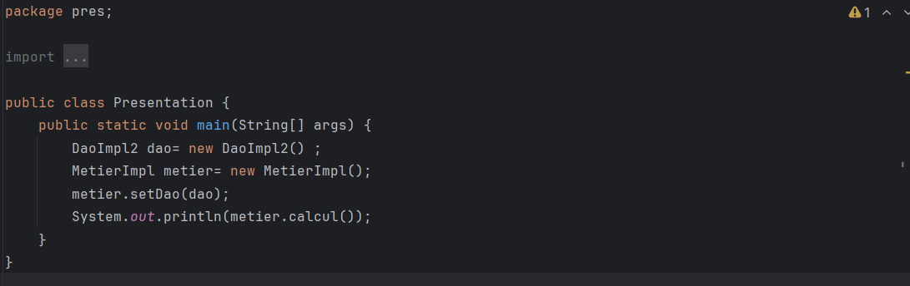

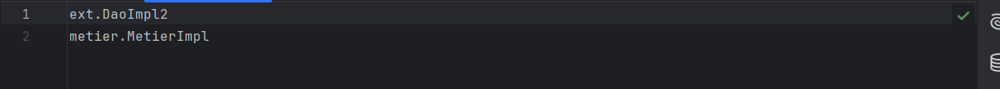

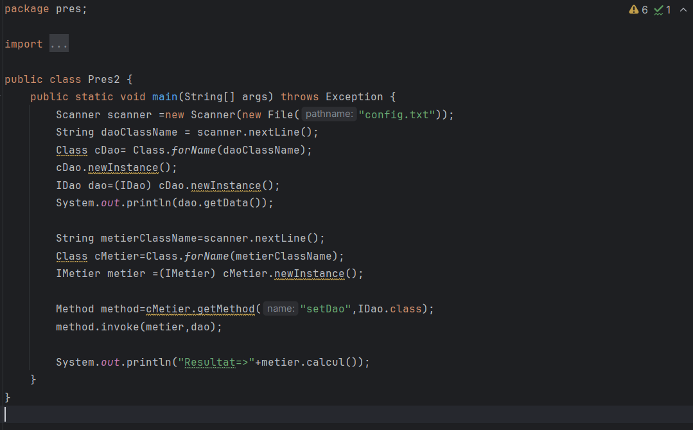

<h4>----Spring Framework----</h4>
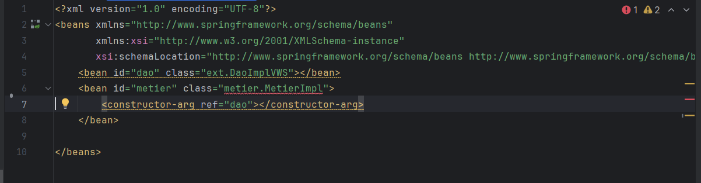

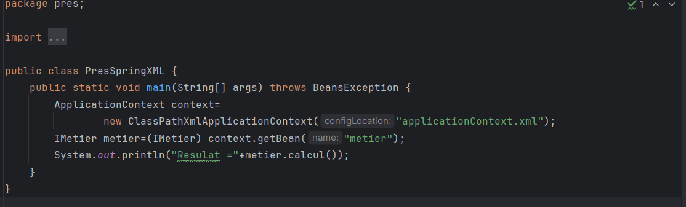

<h6>MetierImpl</h6>

Utilisation d'annotations sur l'implementation de l'interface DAO

*Injection de dependances*

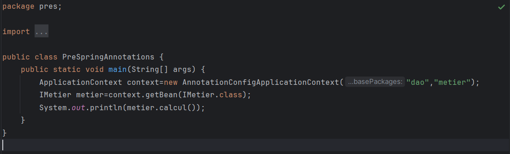
"# DaoJEE" 
